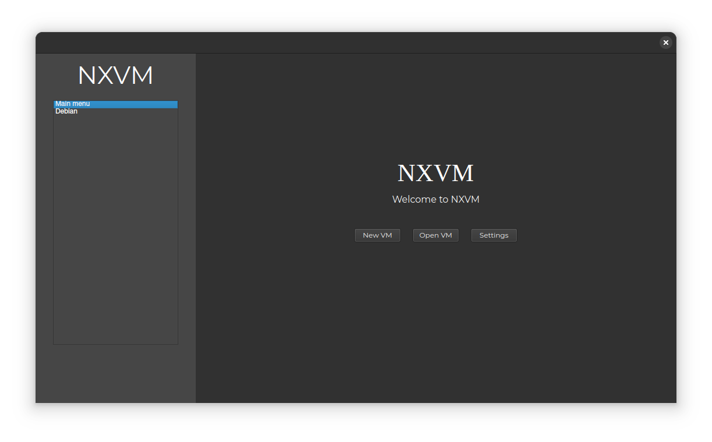

**WARNING** You're reading a README.md file for beta-version v0.1.
This version has a lot of bugs and program can be exited with errors for a many times.
Please report bugs at [project page](https://github.com/vladosnx/nxvm).

# NXVM v0.1

> *Just a VM manager for QEMU*

## What is NXVM

**NXVM** is project which helps you to use QEMU emulator in a few clicks. Please note that NXVM is just a QEMU manager,
not a written from scratch virtual machine.

## Preparing for installation

Now, NXVM has this dependencies:

- `qemu-base`
- `qemu-system-x86`
- `qt5-base`

Installation on Arch Linux and systems based on it

> sudo pacman -S qemu-base qemu-system-x86 qt5-base

## Installation

Open your terminal and execute command:

> curl -sSL https://raw.githubusercontent.com/VladosNX/nxvm/refs/heads/main/install.sh | sudo sh

This command will download and install NXVM from source without buildings.
